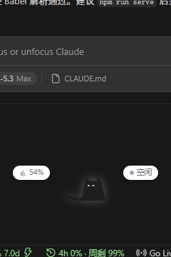
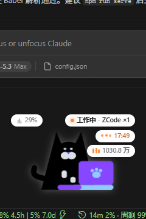
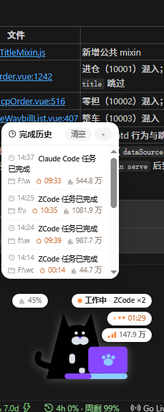
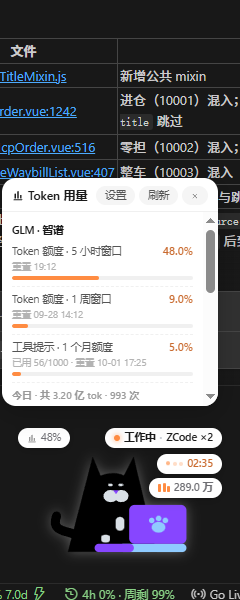
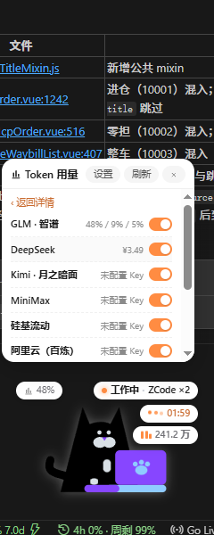
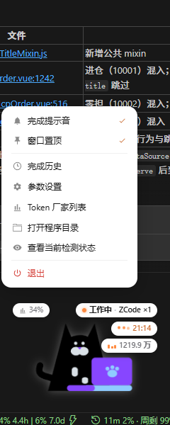
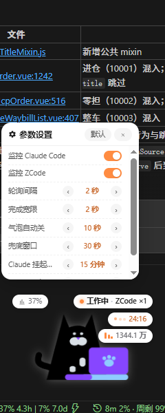
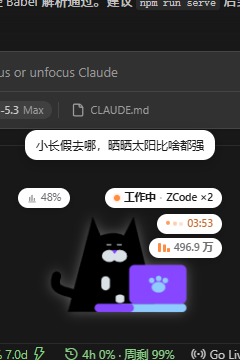

# 🐾 Desktop Pet — 项目介绍

> 一只常驻桌面的电子宠物，实时盯着你的 **Claude Code** 和 **ZCode**：AI 在干活它就敲键盘，干完活它就睡觉，还会告诉你「什么任务、跑了多久、烧了多少 Token」。

Electron 实现，单个透明置顶小窗（240×360），无框架依赖，克隆即跑。

## 界面速览

| 空闲（没有会话在工作） | 工作中（有回合正在进行） |
| --- | --- |
|  |  |

只有两种形态：**空闲**是闭眼慢摇尾巴的黑猫，**工作中**切换成敲紫色笔记本的打字猫。角标从上到下依次是：

- **左上**：Token 用量角标（显示最接近上限的配额百分比，≥80% 变红），点击打开用量详情；
- **右上**：状态角标——灰点「空闲」/ 橙色呼吸点「工作中 · ZCode ×2」，合并显示各来源的并行会话数；
- **工作中追加**：工作用时角标（AI thinking 三点动画 + `mm:ss` 走表）与 Token 消耗角标（本次任务累计的输入+输出总消耗，含缓存读，与套餐额度扣减口径一致）。

宠物可拖拽到任意位置，位置自动记忆。

## 核心功能

### 1. 会话状态实时感知（无侵入，只读日志）

- **ZCode**：解析 `~/.zcode/cli/log/zcode-*.jsonl` 的生命周期事件，按 `sessionId` 分组判断每个会话是否「回合进行中」——工具跑几分钟也不会误判，多会话并行互不干扰；
- **Claude Code**：扫 `~/.claude/projects/<项目>/<sessionId>.jsonl` 文件尾部记录，秒级感知回合开始/结束，子代理行自动跳过；
- 状态每 2 秒刷新（可调），日志解析失败时自动降级为文件 mtime 启发式。

### 2. 工作用时与 Token 消耗

- **用时**：一个任务里来回多个回合只累计「正在工作」的时间，回合间空闲不计时；空闲超过 1 分钟再开工视为新任务，用时清零重计；
- **Token 消耗**：主进程每 400ms 增量扫描本机日志（与状态检测解耦的快速通道），ZCode 取 rollout 的 `usage.totalTokens`，Claude 取会话记录四类 token 求和，子代理消耗也计入。数字带平滑滚动动画、只涨不跌。

### 3. 任务完成播报 + 完成历史



- 「整个任务完成」= 回合结束后静默 **3 分钟**（可配）没有新回合才播报一次，期间继续对话自动撤销判定，不会在对话过程中不停打扰；
- 播报 = 完成气泡卡片（项目名 · 用时 · Token 消耗 · 完成时刻）+ 系统通知 + 提示音，猫跳三下飘爱心；
- 「完成历史」面板保留最近 50 条（含完整路径），可随时翻看/清空；面板贴猫四角智能展开，不遮挡宠物。

### 4. Token 用量监控（多厂家）



按厂家查询配额与用量/余额，详情页聚合展示（上图：GLM 的 5 小时/1 周/1 月三档配额进度条 + 今日用量统计），厂家列表页用开关控制展示项：



内置厂家：**GLM · 智谱**（配额+分模型明细）、**MiniMax / DeepSeek / Kimi / 硅基流动**（余额）、**OpenAI / Anthropic**（token 用量，需管理员 Key）、**阿里云百炼 / 腾讯云混元**（云账户余额，本地完成签名）。API Key 只存本机 `userData`，界面仅回显掩码；也支持环境变量注入。

### 5. 右键功能菜单与参数设置



右键宠物呼出功能菜单：开关提示音/置顶、完成历史、参数设置、Token 厂家列表、打开程序目录、查看实时检测状态、退出。



参数设置面板是 `config.json` 的可视化入口：数值参数按预设档位 `‹ ›` 步进，也可点击数值直接输入自定义时长（认 `90秒`、`3分` 这类写法）；监控 Claude/ZCode 为拨动开关。**改动实时生效并写回配置文件**，无需重启。

### 6. 互动彩蛋



左键点猫会随机蹦出一条语录——共 500 条，其中约 1/10 是动态词（会填入当前时间/星期/时段），联网时还有天气语录、支持电量接口的浏览器里有电量语录；连续点击不重复。

## 快速开始

```bash
npm install   # 已装好可跳过
npm start     # 或直接双击 start.bat
```

命令行：

```bash
npm test         # 检测逻辑的 18 项单元测试
npm run status   # 打印一次实时检测结果
```

## 项目结构

```
main.js        Electron 主进程：透明置顶窗、拖拽、托盘、通知、设置/用量 IPC 桥
monitor.js     检测核心 + Token 消耗增量扫描（可独立 node monitor.js --once 运行）
usage.js       Token 用量查询（provider 注册表，即插即用）
icon.js        纯代码生成托盘图标（无二进制资源）
preload.js     contextBridge 安全桥
renderer/      宠物 UI：SVG 动画 + CSS + WebAudio 提示音 + 面板/菜单/气泡
shots/         本文档使用的界面截图（附自动截屏脚本）
```

## 接入新的监控来源

在 `monitor.js` 里加一个 `xxxStateFromData()` 纯函数 + 一个扫描函数，状态只返回 `working / idle`，挂进 `SessionMonitor.snapshot()` 即可——完成播报、状态角标、历史记录全部自动复用，无需改 UI。

---

更详细的检测原理、配置项说明与已知局限见 [README.md](README.md)。
